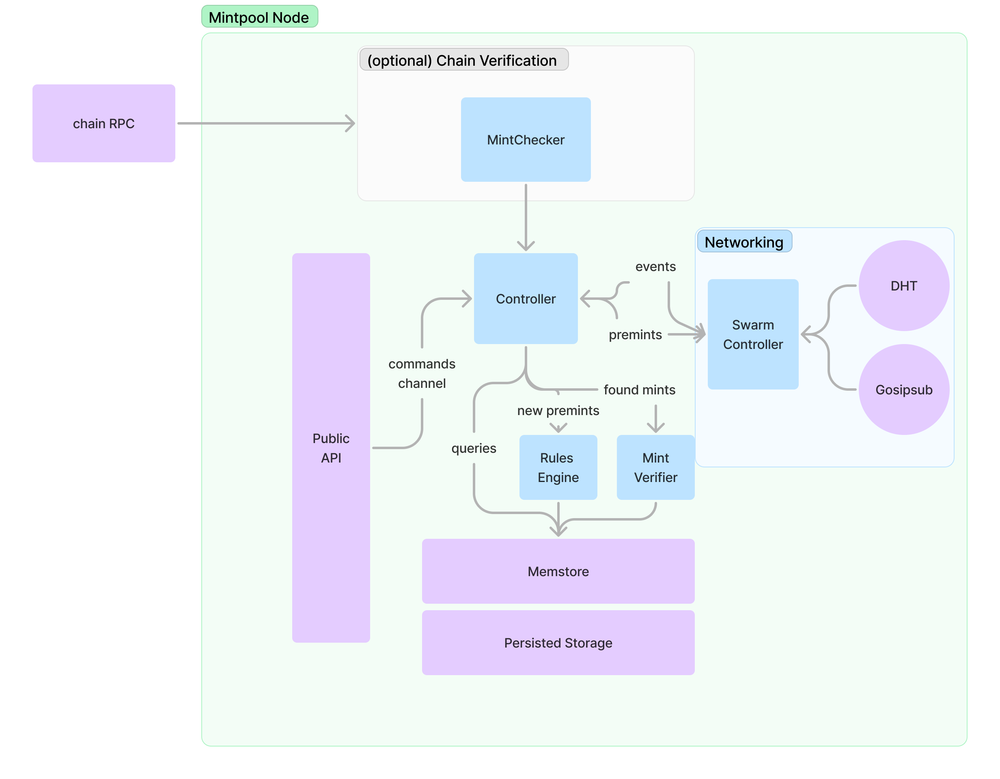

# Developer docs

Documentation for working on mintpool its self.

High level architecture:



## Getting started

[Install rust](https://www.rust-lang.org/tools/install)

This repo uses `just` for task running. See install here: https://github.com/casey/just
or `cargo install just`

Install dependencies:

```sh
just init
```

Install foundry for integration tests, see
instructions [here](https://book.getfoundry.sh/getting-started/installation)

Seed db for type checked sqlx:

```shell
just seed
```

Confirm build and test work

```sh
cargo build
cargo test
```

## Testing

Unit tests live in the bottom of files of the code they test in `#[cfg(test)]` blocks.

```rust
#[cfg(test)]
mod test {
    #[test]
    fn test_something() {
        assert_eq!(1, 1);
    }
}
```

Integration tests live in the `tests` directory and cover the end to end flows of publishing a
premint to bringing it onchain.

All tests can be run with:

```
cargo test
```

For more specific test running instructions see the `cargo` docs.

```sh

Integration tests can override the config in chains.json by setting `CHAIN_{}_RPC_WSS`. Ex:

```rust
env::set_var("CHAIN_7777777_RPC_WSS", anvil.ws_endpoint());
```

## Adding metrics

We using `tracing` for both logging and metrics via the `tracing-opentelemetry` crate. See
docs [here](https://docs.rs/tracing-opentelemetry/latest/tracing_opentelemetry/struct.MetricsLayer.html).

This supports `monotonic_counter`, `counter`, and `histogram` metrics. You use them via `tracing`
but setting
a field on the span.

```rust
tracing::info!(histogram.metric_name = 0.9);
tracing::info!(monotonic_counter.number = 1);
tracing::info!(counter.example3 = 1, other_fields="will be included in tags", "Be careful about cardinality");
```

**Don't put log lines in the same trace statements as metrics, especially if theres a format
variable in the log line,
they will blow up your metrics cardinality and cost a lot of money if you use DataDog**

Metrics are also controlled by the `RUST_LOG` environment variable. This makes it easy to have debug
metrics, just use `tracing::debug!(histogram.debug_thing = 42.1)`.

In the mintpool default binary metrics are exported via Prometheus on `/metrics`, and has count and
latency metrics
on api routes. (`mintpool.api_request_count`, `mintpool.api_request_duration`).
